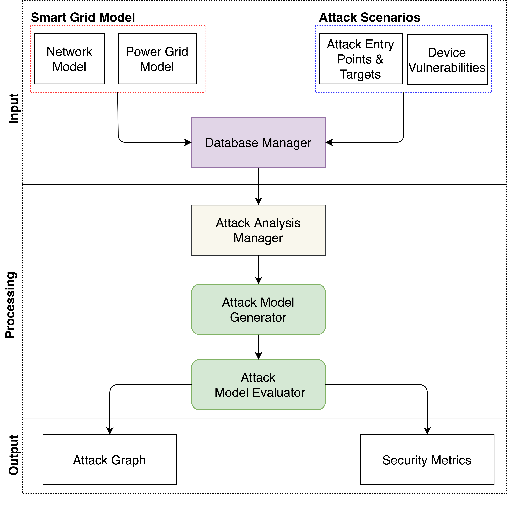
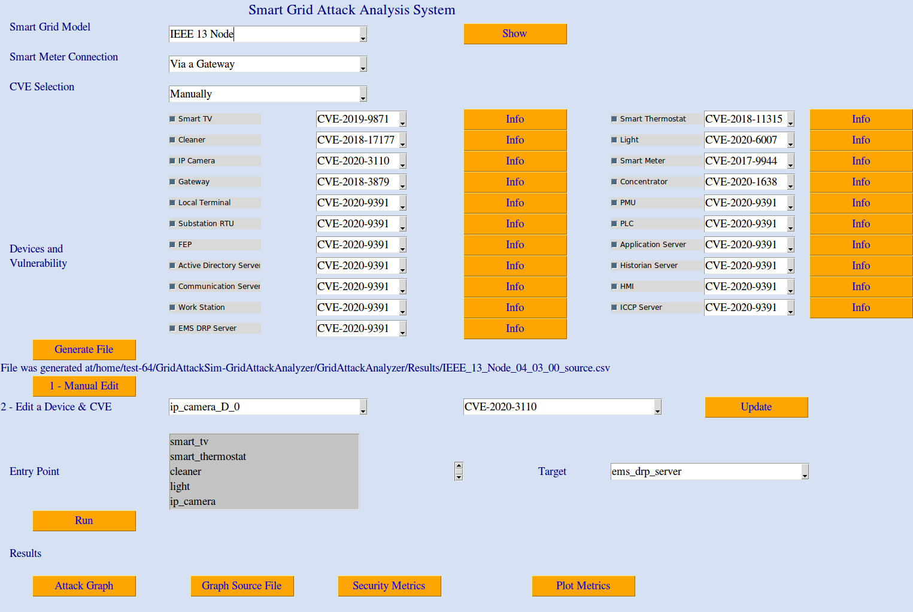

# GridAttackAnalyzer: Smart Grid Attack Analysis Framework

GridAttackAnalyzer is a smart grid attack analysis framework that
makes it possible to determine attack paths and calculate various
security metrics for a given smart grid model and cyber-attack
scenario. The framework is extensible by end users, and the current
release includes three smart grid models, more than 20 types of smart
grid devices, and 40 types of vulnerabilities. GridAttackAnalyzer is
being developed by the Cyber Range Organization and Design
([CROND](https://www.jaist.ac.jp/misc/crond/index-en.html))
NEC-endowed chair at the Japan Advanced Institute of Science and
Technology ([JAIST](https://www.jaist.ac.jp/english/)) in Ishikawa,
Japan.

The functionality that GridAttackAnalyzer provides to assist with the
smart grid attack analysis includes attack tree and attack graph
generation, as well as the computation of attack success probability,
attack impact, attack cost, and attack risk. These characteristics can
be visualized as shown below.


Since GridAttackAnalyzer helps determine all the possible attack paths
in a smart grid, evaluate the consequences of various cyber-attacks,
and estimate the potential damage, several uses of the framework are
possible. Thus, researchers can study how IoT device vulnerabilities
can affect smart grid security, which are the most vulnerable devices
that need to be protected first in order to prevent worst
consequences, and also evaluate objectively the efficiency of various
mitigation strategies.

The architecture of GridAttackAnalyzer, pictured in the figure below,
has the following components:
* **Smart Grid Model**: Definitions of network and power grid models
* **Database**: Information about device types and network
  vulnerabilities
* **Attack Scenarios**: Definition of the attack scenario (entry
  points, targets, vulnerabilities)
* **Database Manager**: Interface that interacts with the end users to
  provide the necessary information from the database to the attack
  analysis manager
* **Attack Analysis Manager**: Core module that manages the entire
  attack analysis process
* **Attack Model Generator**: Creates a model for the attack given the
  input parameters provided by the Analysis Manager
* **Attack Model Evaluator**: Determines the **Attack Graph** and
  calculates the **Security Metrics** corresponding to a given attack
  scenario



End users can extend the features provided by GridAttackAnalyzer by
adding new smart grid topologies, new devices, and new network
vulnerabilities. Please consult the [Developer
Guide](/developer_guide.md) for more information on how to perform
such extensions.


## Installation

GridAttackAnalyzer was developed and tested using Python 3 on the
Ubuntu 18.04 LTS operating system; either a physical host or a virtual
machine installation can be used. Other OSes may work too if they
support running Python 3.

To install GridAttackAnalyzer, use the
[releases](https://github.com/crond-jaist/GridAttackAnalyzer/releases)
page to download the latest version, and extract the source code
archive into a directory of your choice. Then follow the steps below
to set up all the additional components:

1. Install Tkinter, a Python binding to the Tk GUI toolkit, which was
   used to develop the GridAttackAnalyzer GUI:
   ```
   sudo apt-get install python3-tk
   ```
2. Install the `pip3` packet manager:
   ```
   sudo apt install python3-pip
   ```
3. Install other packages required by GridAttackAnalyzer as specified
   in the file `requirements.txt` included with the distribution by
   running the following command from the `GridAttackAnalyzer/`
   directory:
   ```
   sudo -H pip3 install -r requirements.txt
   ```


## Quick Start

1. Use a terminal window to navigate to the GridAttackAnalyzer
   directory, then start the GUI by running the command below:
   ```
   python3 GridAttackAnalyzer.py
   ```

   

2. Once the GUI is displayed, as shown above, follow the next steps to
   configure and run the analysis:

   1. Select the input parameters: Smart Grid Model, Smart Meter
      Connection, CVEs, Devices and Vulnerabilities. The built-in
      network model is shown below; please consider it when selecting
      the devices to make sure that end-to-end routes exist.

      

   2. Click on the "Generate File" button to generate the initial
      attack analysis file; this file can be fine tuned if desired by:
      * _Option 1:_ Click on "1 - Manual Edit" to open the file, then
        edit it directly.
      * _Option 2:_ Use "Edit a Device & CVE" to select a specific
        device and assign a new CVE value to it, then click on
        "Update" to bring the attack analysis file up to date.

   3. Click on the "Run" button to start the attack analysis.

   4. When the attack analysis process finishes, you can use any of
      the following functions by clicking on the corresponding
      buttons:
      * Attack Graph: Show the computed attack graph
      * Graph Source File": Show the CSV file containing the attack
        graph data
      * Security Metrics: Show the CSV file containing the
        computed security metrics
      * Plot Metrics: Visualize the computed security metrics


## References

For a research background regarding GridAttackAnalyzer, please refer to the
following papers:

* T. D. Le, M. Ge, P. T. Duy, H. D. Hoang, A. Anwar, S. W. Loke,
  R. Beuran, Y. Tan, "CVSS Based Attack Analysis using a Graphical
  Security Model: Review and Smart Grid Case Study", 4th EAI
  International Conference on Smart Grid and Internet of Things (SGIoT
  2020), TaiChung, Taiwan, December 5-6, 2020, pp. 116-134.

For a list of contributors to this project, check the file
CONTRIBUTORS included with the source code.
